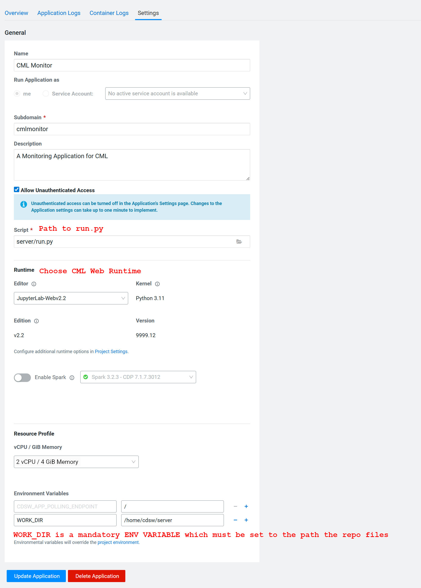

# CML Monitor

> **⚠️ VERY IMPORTANT DISCLAIMER ⚠️**
> 
> This project is an independent effort and is **NOT an official Cloudera product**. It has **not** been tested for security vulnerabilities or issues. It is **highly recommended** to deploy and run this application strictly in a secure, no-internet (air-gapped) environment. Use at your own risk.

---

## Overview

**CML Monitor** is a Flask-based web application designed to serve as a unified monitoring dashboard for Cloudera Machine Learning (CML), recently renamed to [Cloudera AI](https://docs.cloudera.com/machine-learning/cloud/product/topics/ml-product-overview.html). 

The application connects to the underlying Kubernetes cluster running on Cloudera ECS Hosts via an `rke2.yaml` configuration file. It uses this configuration to look up all running Kubernetes pods and intelligently matches them with active workloads on CML via the CML API. 

## Features

* **Unified Dashboard:** A centralized home page displaying active workloads across CML, complete with advanced filtering (Sessions, Applications, Jobs), search functionalities, and Excel report downloads.
* **Role-Based Visibility:** Local and LDAP users can be restricted to viewing only their own workloads, while Admins (`is_admin`) can monitor all cluster activity.
* **Automated Alerts & Reports:** Background processes monitor the cluster to send alert emails for "zombie" sessions (running $\ge$ 24 hours) and scheduled summary reports of all workloads via SMTP.
* **In-App Configuration Management:** A dedicated settings UI for authorized admins (`config_admin`) to modify CML, LDAP, and Alert parameters on the fly.

---

## Deployment & Setup Flow

The application is built to run natively as a **CML Application** using a custom runtime called `CMLWeb`. 

### 1. Build the Custom Runtime (`CMLWeb`)
To run this application on CML, you must first build the required runtime environment using Cloudera's base images. Follow these steps:

1. **Clone the Cloudera ML Runtimes repository:**
   ```bash
   git clone https://github.com/cloudera/ml-runtimes.git
   cd ml-runtimes
   ```

2. **Prepare the Dockerfile:**
   Move the `cmlweb.Dockerfile` provided in this repository into the cloned `ml-runtimes` directory and rename it to `Dockerfile`.
   ```bash
   mv /path/to/CMLMonitor/cmlweb.Dockerfile ./Dockerfile
   ```

3. **Build the Docker Image:**
   Run the following command to build the image (disabling the cache is recommended to ensure you get the latest base layers):
   ```bash
   docker build --no-cache -t cml-web:v2.2 .
   ```

4. **Save the Image as a Tarball:**
   First, find the Image ID of your newly built runtime:
   ```bash
   docker images | grep cml-web
   ```
   Copy the `<image_id>` and save the image to a tar file so it can be uploaded or deployed to your environment:
   ```bash
   docker save -o cml-webv2.2.tar <image_id>
   ```

### 2. Application Creation on CML
Once your runtime is built and available in your CML environment, you need to create the Application within your CML Project.

* **Startup Script:** Set the starting script to `run.py`. This script uses Gunicorn to serve the Flask application (`app.py`). 
    * *Note:* Gunicorn is configured by default to run with 5 worker processes. You can modify this inside `run.py` to better suit your workload.
* **Resource Requirements:** For the application to function smoothly, the **minimum recommended resources are 2 vCPU and 4 GB RAM**.

*(Please refer to the screenshot below for an example of the CML Application settings configuration)*

> ****


### 3. Initial Application Boot
When the application is launched for the very first time, it follows a strict initialization sequence:

1.  **Create Admin Page:** If the database (SQLite) has no users, the application forces the creation of a local system administrator. Submitting this form initializes the `users` table, populates the `configs` table with default values, and redirects to the login screen.
2.  **Login Page:** Standard authentication interface. 
3.  **Initial Setup Wizard:** Upon logging in, if the application detects it has not been configured (the `init` attribute in the DB is `0`), the admin is redirected to a 3-step setup wizard:
    * **Step 1: CML Configs (Mandatory):** Requires the CML Workspace Domain, an Admin API Key, the user namespace prefix, and the `rke2.yaml` file (found on any ECS Master Server).
    * **Step 2: LDAP Configs (Optional):** Active Directory settings for organizational user sync.
    * **Step 3: SMTP Alerts (Optional):** Email routing settings for automated reports and alerts.

---

## Configurations

Application settings are categorized into three main sections, accessible via the UI for users with the `config_admin` privilege:

* **CML Configs (Mandatory):** The application cannot function without valid CML API credentials and the Kubernetes config file. 
* **LDAP Configs (Optional):** Enables LDAP authentication. When enabled, standard LDAP users logging in will only see the workloads they have explicitly launched on CML (unless granted admin privileges).
* **Alerts Configs (Optional):** Manages automated email routines based on cron expressions. 
    * *Alert Cron:* Scans for sessions running $\ge$ 24 hours.
    * *Report Cron:* Compiles and emails a summary of all running workloads.
    * *Note:* If cron expressions are left blank, background processes will not run.

---

## User Management (CLI)

While initial admin setup happens in the UI, subsequent user management is handled via the command-line script `cmlmonitor_db.py`. 

### Create a User
Creates a local user. Use the flags `--is-admin` to allow the user to see all cluster workloads, and `--config-admin` to grant access to the settings page.
```bash
python cmlmonitor_db.py user create -u [username] -p [password] -m [email] -f [fullname] --is-admin --config-admin
```

### Update an Existing User
Modifies user details or privileges. *Note: If the user is an LDAP user, only their privileges (`--is-admin` / `--config-admin`) can be updated.*
```bash
# Add or revoke privileges using the respective flags
python cmlmonitor_db.py user update -u [username] -p [password] -m [email] -f [fullname] --is-admin --no-config-admin
```

### Delete a User
Removes a user entirely from the local database.
```bash
python cmlmonitor_db.py user delete -u [username]
```

---

## Database Architecture

The backend currently utilizes **SQLite**. Below is an overview of the core SQLAlchemy models:

* **`User` Model:** Manages authentication and authorization flags.
    * Stores `username`, `password` (nullable for LDAP/external users), `mail`, and `fullname`.
    * **Roles:** `is_admin` (View all workloads) and `config_admin` (Access configuration page).
    * Tracks `created_at` and `updated_at`.
* **`Config` Model:** Stores dynamic application settings as Key-Value pairs.
    * Stores `attr` (attribute name) and `value`.
    * Tracks the `updated_by` user via a foreign key relationship to the `User` table, ensuring accountability for system changes.